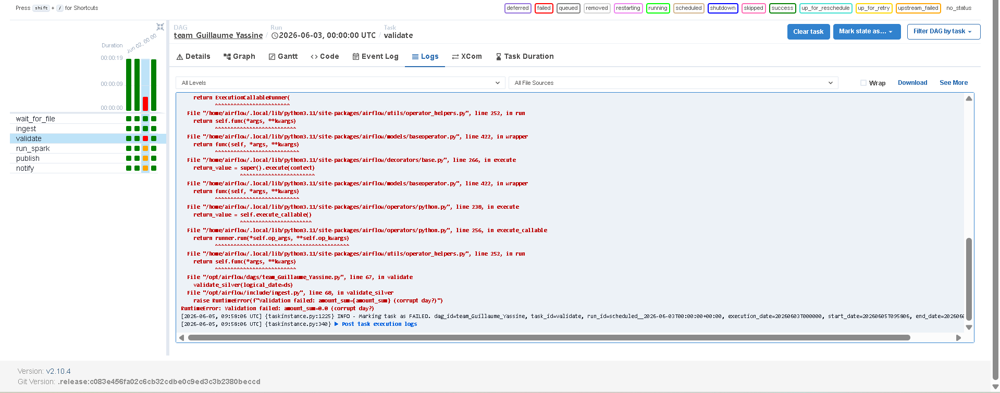
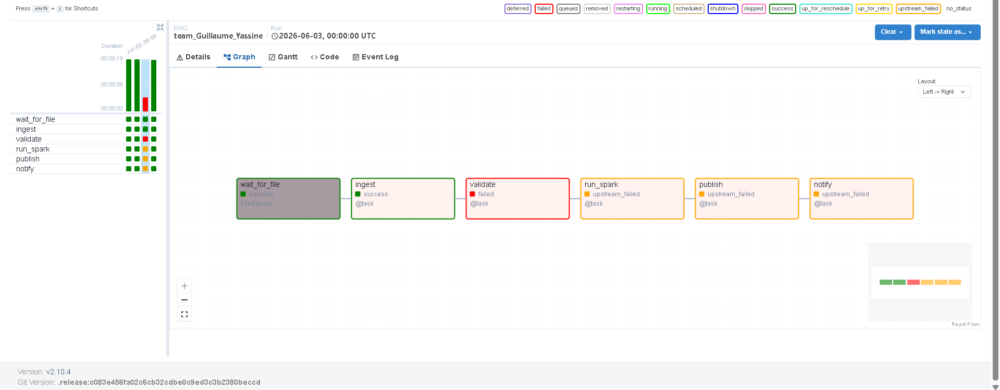
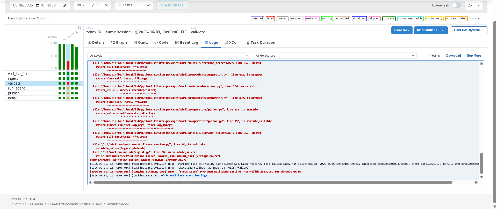

# Team: Guillaume Demontgolfier & Yassine Gharbi

**DAG id:** `team_Guillaume_Yassine`  
**Git repo:** `https://github.com/demontgolfierguillaume-prog/Projet_Big_Data` — **also visible on the title slide**  
**Spark module:** `include/team_spark_Guillaume_Yassine.py`  
**Course:** Big Data Processing - Lab 4 Capstone

---

## 1. Business problem

A retail operator receives **daily CSV transaction files** from an upstream vendor covering 6 countries (FR, DE, ES, IT, BE, NL) and 7 product categories. Without an automated pipeline, analysts must manually ingest files and compute KPIs — introducing errors, delays, and inconsistent results.

**Who needs the dashboard?** Business analysts and operations managers rely on `dashboard_<ds>.json` every morning to track daily revenue, transaction volumes, and average ticket per country/category/payment method.

**What breaks if the pipeline fails?**
- The daily revenue dashboard goes dark — no KPIs available for business decisions.
- Downstream Spark job may run on stale or missing silver data, producing corrupt gold output.
- Manual re-runs risk data drift and inconsistency across days.

---

## 2. Architecture

```
data/incoming/transactions_<ds>.csv
        │  (FileSensor waits)
        ▼
[ingest] DuckDB → data/raw/dt=<ds>/transactions.parquet        (Silver)
        │
        ▼
[validate] DuckDB quality checks (row_count, amount_sum)
        │
        ├──────────────────────────────────────────┐
        ▼                                          ▼
[run_spark] PySpark → data/curated/dt=<ds>/    [notify] success log
            kpis_by_category_country.parquet
        │
        ▼
[publish] → data/reports/dashboard_<ds>.json   (Serve)
```

| Layer  | Path                            | Tool                                      |
|--------|---------------------------------|-------------------------------------------|
| Bronze | `data/incoming/`                | `vendor_drop.py`                          |
| Silver | `data/raw/dt=<ds>/`             | DuckDB (`ingest_day`)                     |
| Gold   | `data/curated/dt=<ds>/`         | PySpark — `team_spark_Guillaume_Yassine.py` |
| Serve  | `data/reports/`                 | JSON dashboard                            |

### Airflow — 6 tasks

| task_id        | Type                   | Role                                                                                      |
|----------------|------------------------|-------------------------------------------------------------------------------------------|
| `wait_for_file` | `FileSensor`          | Polls `data/incoming/` every 30 s (timeout 600 s) for `transactions_{{ ds }}.csv`. Mode: `reschedule` — frees the worker slot between polls. |
| `ingest`        | `@task`               | Calls `ingest_day(ds)`: DuckDB reads the CSV and writes idempotent Parquet to `data/raw/dt=`. Deletes any existing file first. |
| `validate`      | `@task` (retries=0)   | Calls `validate_silver(ds)`: asserts `row_count ≥ 10` and `amount_sum > 0.01`. Fires `on_failure_callback` on corrupt data. |
| `run_spark`     | `@task`               | Calls `run_daily(ds)` → transform_1 → transform_2 → transform_3. Writes curated Parquet + dashboard JSON. |
| `publish`       | `@task`               | Logs the path to `data/reports/dashboard_<ds>.json`. Downstream hook point for BI tools. |
| `notify`        | `@task`               | Logs a `[SUCCESS]` message. Runs **in parallel** with `run_spark` (fanout after validate). |

**Dependency graph:**

```
wait_for_file → ingest → validate → run_spark → publish
                                  ↘ notify
```

---

## 3. Spark transformations (≥3)

File: `include/team_spark_Guillaume_Yassine.py`

| # | Function       | What it does                                                                                                        |
|---|----------------|---------------------------------------------------------------------------------------------------------------------|
| 1 | `transform_1`  | **Read + Clean** — reads silver Parquet, casts `amount_eur` to double, drops nulls on amount/country/category, removes outliers (≥ 5 000 EUR), extracts `hour` and `day` from timestamp. |
| 2 | `transform_2`  | **Enrich** — buckets amount into `low/mid/high/vip`, maps country to `region` (EUROPE / BENELUX_DACH / OTHER), adds `is_high_value` and `big_spender` flags, classifies `payment_risk`, adds partition column `ds`. |
| 3 | `transform_3`  | **KPI Aggregation** — `groupBy(country, category, payment_method)` → `SUM(amount_eur)` as `revenue`, `COUNT(*)` as `transactions`, `AVG` as `avg_ticket`, `MAX` as `max_ticket`. |

Output:
- Curated Parquet → `data/curated/dt=<ds>/kpis_by_category_country.parquet` (`mode="overwrite"`)
- Global KPIs + curated path → `data/reports/dashboard_<ds>.json`

---

## 4. Idempotence

Re-running the DAG for the same `ds` is fully safe:

| Layer             | Mechanism                                                                              |
|-------------------|----------------------------------------------------------------------------------------|
| `raw/dt=<ds>/`    | `ingest_day()` calls `pq_path.unlink()` before writing → old Parquet deleted first.   |
| `curated/dt=<ds>/` | PySpark uses `mode("overwrite")` → partition directory is fully replaced.             |
| `dashboard_<ds>.json` | Written with `open(..., "w")` → always overwritten regardless of prior content.   |

**Result:** triggering the same `ds` twice yields bit-for-bit identical output. Backfill is safe.

---

## 5. Backfill

```bash
docker compose exec airflow-scheduler \
  airflow dags backfill team_Guillaume_Yassine -s 2026-06-01 -e 2026-06-07 --reset-dagruns
```

Pre-seed all 14 days of data before backfilling:

```bash
python scripts/vendor_drop.py --seed-pack --volume small
```

---

## 6. Failure demo

```bash
python scripts/vendor_drop.py --date 2026-06-03 --corrupt
```

**What `--corrupt` does:** generates `transactions_2026-06-03.csv` with `amount_eur = 0.0` on every row (seeded RNG, deterministic).

**Which task fails:** `validate` — `validate_silver()` asserts `amount_sum > 0.01`; since all amounts are zero, `RuntimeError: Validation failed: amount_sum=0.0 (corrupt day?)` is raised.

**What appears in the Airflow UI:**
- `validate` turns **red** (no retries — `retries=0`)
- `on_failure_callback` fires → logs `[ERROR ALERT] DAG=team_Guillaume_Yassine TASK=validate FAILED for ds=2026-06-03`
- `run_spark` and `publish` are **skipped** — no stale gold data is written
- `notify` is also skipped (downstream of validate)

---

## 7. Exploration tracks

| Track         | Done? | Implementation                                                                                  |
|---------------|-------|-------------------------------------------------------------------------------------------------|
| R Reliability | yes    | `retries=2`, `retry_delay=3min` on all tasks; `retries=0` + `on_failure_callback` on `validate`. |
| S Spark depth | yes    | 3 named transforms (read/clean, enrich, aggregate); `mode("overwrite")`; dashboard JSON export. |
| O Orchestration | yes  | `FileSensor` with `mode=reschedule`; `catchup=True`; fanout (validate → run_spark + notify).   |
| Q Data quality | yes   | `validate_silver()` checks `row_count` and `amount_sum`; circuit-breaker before Spark runs.    |
| P Custom      | —     | —                                                                                               |
| X SparkSubmit | yes    | `spark_jobs/daily_kpis.py` — standalone CLI entrypoint via `spark-submit` (calls `run_daily_cli()`). |

---

## 8. Demo script & backup

### Happy path (~5 min)

```bash
# 1. Start the stack
docker compose up -d

# 2. Drop a vendor file for June 1
python scripts/vendor_drop.py --date 2026-06-01

# 3. Open Airflow UI → http://localhost:8080 (admin/admin)
#    Trigger DAG: team_Guillaume_Yassine for ds=2026-06-01
#    Watch: wait_for_file → ingest → validate → run_spark → publish (all green)

# 4. Show the output
cat data/reports/dashboard_2026-06-01.json
```

### Failure demo (~2 min, optional)

```bash
# Corrupt a day's data
python scripts/vendor_drop.py --date 2026-06-03 --corrupt

# Re-trigger the DAG for ds=2026-06-03
# → validate turns red in the UI; run_spark and publish are skipped
```

### Backup (if Docker fails on June 10)

Screenshots available in `scripts/demo_backup/`:
- Airflow graph view — full green run
- `dashboard_2026-06-01.json` content
- Red `validate` task after `--corrupt`
- `on_failure_callback` log output

---

## 9. Production next steps

- Replace `local[*]` with Databricks / EMR cluster — zero code changes needed (SparkSession abstraction)
- Push curated Parquet to S3 / GCS; connect Metabase or Superset to `data/reports/`
- Add Great Expectations step after `validate` for schema drift detection
- Replace filesystem vendor drop with Airflow SFTP/S3 sensor for real upstream integration
- Add SLA alerts (Airflow `sla` parameter) and email/Slack notifications on failure

---

### Run screenshots

**Successful run:**



**Failure — corrupt vendor drop:**




**Failure log:**



**Notify task on failure:**

